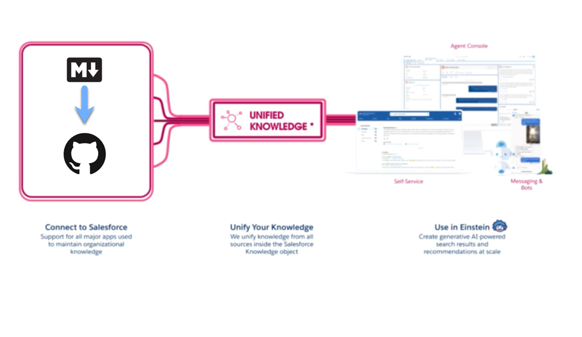

# Markdown Sample

## Installation 
Fusce at interdum lacus. Integer iaculis nunc sit amet erat ullamcorper, a dapibus nisi convallis. In et odio a dolor condimentum hendrerit:
* Curabitur eu urna eget tortor imperdiet placerat.
* Sed gravida rutrum odio, aliquet varius tellus sollicitudin a.
* In metus elit, cursus vitae posuere et, mattis a nulla.
* Maecenas suscipit metus lorem, at faucibus felis tempus a.
* Vestibulum venenatis risus id dolor dictum, vitae auctor nisl pellentesque.
* Nulla in tellus convallis, eleifend purus sed, viverra orci.
* Suspendisse nec pulvinar sem.
* Aliquam ornare gravida lectus vel posuere. Vestibulum vitae efficitur dolor.
* Aliquam tempus pharetra imperdiet.

## Part 1 

Nunc sagittis urna non arcu vehicula, in ultrices neque sagittis. Phasellus condimentum aliquet porta. Nulla vel urna mi. Nam vestibulum arcu enim, eu vehicula ex porttitor in. Quisque dignissim risus eu fermentum suscipit. Aenean condimentum euismod urna a congue. Vivamus neque turpis, pellentesque vel nibh ut, vestibulum finibus libero. Proin consequat convallis interdum. Sed at rhoncus tellus. Phasellus rutrum, risus vitae sagittis sagittis, lorem orci ultricies nibh, in bibendum lectus odio a dolor. Nunc ac pellentesque elit. Donec at nibh sagittis, gravida elit sed, sagittis lorem. Nunc luctus finibus mauris quis pharetra. Pellentesque id convallis justo. In sit amet sem vitae sapien placerat viverra.




| Month    | Amount   | To        | For     |
| -------- | -------- | --------- | ------- |
| January  | $250     | Lisa      | Bday    |
| February | $80      | George    | Gas     |
| March    | $420     | Mary      | Rent    |


### Code block no syntax highligting, tic marks not showing

```
function test() {
  console.log("notice the blank line before this function?");
}
```

### Code block no syntax highligting, tic marks showing


````
```
function test() {
  console.log("notice the blank line before this function?");
}
```
````

### Code block with syntax highlighting

```ruby
require 'redcarpet'
markdown = Redcarpet.new("Hello World!")
puts markdown.to_html
```


#### (Optional) Sub step 1 - {Subtask name}

Paragraphs are separated by a blank line.

2nd paragraph. *Italic*, **bold**, and `monospace`. Itemized lists
look like:

  * this one
  * that one
  * the other one

Note that --- not considering the asterisk --- the actual text
content starts at 4-columns in.

> Block quotes are
> written like so.
>
> They can span multiple paragraphs,
> if you like.

Use 3 dashes for an em-dash. Use 2 dashes for ranges (ex., "it's all
in chapters 12--14"). Three dots ... will be converted to an ellipsis.
Unicode is supported. ☺## Part 2 - {Description}

Use this section to summarize what users will complete in the following steps.

### More formatting

Here's a numbered list:

 #. first item
    a. more
    b. even more
    c. and then some more
 #. second item
 #. third item

Note again how the actual text starts at 4 columns in (4 characters
from the left side). Here's a code sample:

    # Let me re-iterate ...
    for i in 1 .. 10 { do-something(i) }

As you probably guessed, indented 4 spaces. By the way, instead of
indenting the block, you can use delimited blocks, if you like:

~~~
define foobar() {
    print "Welcome to flavor country!";
}
~~~

(which makes copying & pasting easier). You can optionally mark the
delimited block for Pandoc to syntax highlight it:

~~~python
import time
# Quick, count to ten!
for i in range(10):
    # (but not *too* quick)
    time.sleep(0.5)
    print i
~~~

### Step 2 - {Task name}

Now a nested list:

 1. First, get these ingredients:

      * carrots
      * celery
      * lentils

 2. Boil some water.

 3. Dump everything in the pot and follow
    this algorithm:

        find wooden spoon
        uncover pot
        stir
        cover pot
        balance wooden spoon precariously on pot handle
        wait 10 minutes
        goto first step (or shut off burner when done)

    Do not bump wooden spoon or it will fall.

Notice again how text always lines up on 4-space indents (including
that last line which continues item 3 above).

Here's a link to [a website](http://foo.bar), to a [local
doc](local-doc.html), and to a [section heading in the current
doc](#an-h2-header). Here's a footnote [^1].

[^1]: Footnote text goes here.


### Tables

Tables can look like this:

size  material      color
----  ------------  ------------
9     leather       brown
10    hemp canvas   natural
11    glass         transparent

Table: Shoes, their sizes, and what they're made of

(The above is the caption for the table.) Pandoc also supports
multi-line tables:

--------  -----------------------
keyword   text
--------  -----------------------
red       Sunsets, apples, and
          other red or reddish
          things.

green     Leaves, grass, frogs
          and other things it's
          not easy being.
--------  -----------------------


### Other formatting

A horizontal rule follows.

***

Here's a definition list:

apples
  : Good for making applesauce.
oranges
  : Citrus!
tomatoes
  : There's no "e" in tomatoe.

Again, text is indented 4 spaces. (Put a blank line between each
term/definition pair to spread things out more.)

Here's a "line block":

| Line one
|   Line too
| Line tree


Inline math equations go in like so: $\omega = d\phi / dt$. Display
math should get its own line and be put in in double-dollarsigns:

$$I = \int \rho R^{2} dV$$

And note that you can backslash-escape any punctuation characters
which you wish to be displayed literally, ex.: \`foo\`, \*bar\*, etc.

## Introduction

{Before using this template, please read the accompanying About the Style Guide
Template documentation.}

Welcome to our project! This style guide is intended for use by project
contributors, not necessarily end-users. It provides general guidance to anyone
who contributes to the project's documentation.

## Intended audience and scope

This style guide is intended for use by any contributors that are writing
documentation for {Your Project Name}, including software engineers. This guide
can help project contributors to communicate clearly and consistently in {you
define the scope: the project's end-user documentation, API documentation,
forum posts, and so forth.}

## Our preferred style guide

We have adopted the
{[your preferred style guide, such as the Google developer documentation style guide](https://developers.google.com/style)}
for {Your Project} documentation. For a quick summary, see the
[Google style guide highlights](https://developers.google.com/style/highlights).
The rest of this document describes our project-specific customizations to
{Google's or your preferred} guide.

Our project uses {your choice: standard American spelling or standard British
spelling, etc.} and our preferred dictionary is the
{[American Heritage Dictionary](https://ahdictionary.com/) or your preferred
dictionary}.

When writing documentation for our project, align with the default guide's
voice and tone.

## Glossary of preferred terms

{Calling out how to write your project name first is optional. You can choose to include your project name in the word list instead.}

This {Your Project Name} is represented as {example}. It is {always/never}
capitalized.

The table provides guidelines about the terms you should and should not use for
consistency, listed in alphabetical order:

Preferred Term  | Avoid These Terms  |  Explanation
--------------- | -----------------  |  -----------
for example     | e.g.               |  Avoid non-English words
people with disabilities  | <ul><li>the disabled</li><li>disabled people</li><li>people with handicaps</li><li>the handicapped</li></ul>  |  Use inclusive and bias-free language. See [Accessible Writing](#accessible-writing)
that is         |  i.e.              |  Avoid non-English words

## Topic types and templates

This project recommends using the following templates from the
[Good Docs project](https://github.com/thegooddocsproject/templates):

- API Overview
- API Quickstart
- API Reference
- Discussion Article
- How To Guide
- Logging Article
- Reference Article
- Tutorial

## General writing tips

{This section is optional.}

For some general tips about improving writing see:

- [Write the Docs - Style Guides](https://www.writethedocs.org/guide/writing/style-guides/#writing-style)
- [18F Content Guide](https://content-guide.18f.gov/)

## Accessible writing

Documentation should be written in a way that supports people with disabilities
and users with various input methods and devices. Improving accessibility also
helps make documentation clearer and more useful for everyone.

For resources on making your writing more accessible, see:

- [Writing accessible documentation - Google developer documentation style guide](https://developers.google.com/style/accessibility)
- [Accessibility guidelines and requirements - Microsoft Writing Style Guide](https://docs.microsoft.com/en-us/style-guide/accessibility/accessibility-guidelines-requirements)
- [Writing for Accessibility - Mailchimp Content Style Guide](https://styleguide.mailchimp.com/writing-for-accessibility/)

## Inclusive and bias-free writing

When contributing to this project, you should strive to write documentation with
inclusivity and diversity in mind. Inclusive language recognizes diversity and
strives to communicate respectfully to all people. This kind of language is
sensitive to differences and seeks to promote equal opportunities.

For resources on making your writing more inclusive, see:

- [Inclusive documentation - Google developer documentation style guide](https://developers.google.com/style/inclusive-documentation)
- [The Conscious Style Guide - a collection of resources](https://consciousstyleguide.com/)
- [Bias-free communication - Microsoft Writing Style Guide](https://docs.microsoft.com/en-us/style-guide/bias-free-communication)
- [Guidelines for Inclusive Language - Linguistic Society of America](https://www.linguisticsociety.org/resource/guidelines-inclusive-language)

## Using linters

{This section is optional.}

This project uses the {your preferred linter.}

{Provide instructions or policies related to the linter here.}

## HTML Table

<table>
  <tr>
    <th>Company</th>
    <th>Contact</th>
    <th>Country</th>
  </tr>
  <tr>
    <td>Alfreds Futterkiste</td>
    <td>Maria Anders</td>
    <td>Germany</td>
  </tr>
  <tr>
    <td>Centro comercial Moctezuma</td>
    <td>Francisco Chang</td>
    <td>Mexico</td>
  </tr>
</table>

## Revision history

{This section is optional or can be combined with the next section if needed.}

The following table describes the history of all decisions and revisions made to
this style guide over time. This guide uses the Major.Minor.Patch
[semantic versioning](https://semver.org/) convention.

Edition  |  Date          |  Lead Author(s)    |  Link to Repository Commit/Tag
-------  |  ----          |  --------------    |  -----------------------------
{0.1}    |  {YYYY-MM-DD}  |  {Your name here}  |  First draft of Style Guide


## Decision log

{This section is optional or can be combined with the previous section if
needed.}

The following table describes the history of all decisions made to this style
guide over time:

Ref  |  Date         |  Description                               |  Agreed to by
---  |  ----         |  -----------                               |  ------------
1    | {YYYY-MM-DD}  |  {Explain the decision that was made here} |  {Name or role}
